# The Deleometer

AI-powered journaling, multi-perspective analysis, goal generation, and reflective chat for Obsidian.

Active repository:
[github.com/MichelleGDyason/The_Obsidian_Deleometer_v2](https://github.com/MichelleGDyason/The_Obsidian_Deleometer_v2)

## Safety and Interpretation

The Deleometer is a reflective conversation and journaling tool. It is not a medical device, diagnosis, treatment, or substitute for medication, therapy, crisis support, or professional care already used by the journal author.

AI can make mistakes and can sound more certain than it is. Treat Deleometer responses as invitations to think with, question, revise, and discuss, not as truth to absorb undiluted. Use it like a rigorous conversation with a thoughtful friend, not an all-knowing or infallible robot. Continuing to chat with the AI can help mistakes become clearer, because you can challenge the response, ask for evidence, request a simpler explanation, or ask it to reinterpret the same entry through another frame.

Your OpenAI API key is hidden in the settings screen, but it is still stored locally in Obsidian plugin data. If your vault, device backups, or plugin data are synced or shared, treat the key as sensitive.

## Security and Privacy

The Deleometer is an Obsidian plugin, not a sealed or encrypted vault. AI features send the relevant journal, chat, goal, author memory, and analysis context to OpenAI. The settings include privacy controls for redacting common sensitive details before AI calls, keeping author memory local, excluding the personality profile from prompts, clearing stored author memory, clearing the API key, and avoiding full-journal context in perspective chat.

Saved analyses, chats, goals, author memory, and plugin settings are stored locally as Obsidian data or Markdown. The Deleometer does not encrypt those files. Anyone with access to the vault, backups, sync provider, device account, or another sufficiently powerful Obsidian plugin may be able to read them. Install the plugin only from the MichelleGDyason GitHub repository or the official Obsidian community plugin listing when available, and treat BRAT beta releases as development builds.

## License Position

This project is licensed under the GNU Affero General Public License v3.0.

Why AGPL-3.0:

- it keeps the plugin open source
- it prevents privatized improvements from being closed off from the community
- it requires derivative works, including hosted or networked versions, to provide source code under the same license

As copyright holder, Michelle G Dyason may choose to relicense future versions under MIT if community adoption clearly requires a more permissive license. That does not change the license of versions already released under AGPL.

## What It Does

The Deleometer helps you:

- write journal entries inside Obsidian
- generate multi-perspective AI analyses from each entry
- continue a live AI chat from a specific analysis perspective
- save that chat back into the original journal analysis note
- turn analysis suggestions into editable goals
- track goals and generated milestone notes
- consolidate similar goals and similar milestones
- optionally sync goals and milestones into the Full Calendar plugin
- review activity in an emotional intelligence dashboard

The plugin keeps an author memory summary so later analyses can respond as part of an ongoing reflective conversation with previous analyses. This is meant to help recurring themes, values, supports, risks, and patterns become easier to notice over time.

## Requirements

- Obsidian `1.5.0` or later
- an OpenAI API key
- desktop Obsidian is recommended for the full workflow

## Installation

### Manual Install

1. Create a plugin folder in your vault:
   `.obsidian/plugins/the-deleometer/`
2. Copy these files into that folder:
   - `manifest.json`
   - `main.js`
   - `styles.css`
3. Restart Obsidian or reload community plugins.
4. Enable `The Deleometer` in Community Plugins.

### Development Build

1. Install dependencies:

```bash
npm install
```

2. Build the plugin:

```bash
npm run build
```

3. Copy the runtime files into your Obsidian plugin folder:
   - `main.js`
   - `manifest.json`
   - `styles.css`

Obsidian does not load `main.ts` directly. It must be built into `main.js`.

## Setup

After enabling the plugin:

1. Open `Settings -> Community plugins -> The Deleometer`.
2. Paste your OpenAI API key.
3. Confirm or change the journal, goals, and milestones folders.
4. If you use Full Calendar, set the `Full Calendar Folder` to the folder watched by your Full Calendar local source.

## Basic Workflow

1. Create a journal entry.
2. Use `Save & Analyze`.
3. Review the AI analysis sections.
4. Click the perspective chat link you want to continue.
5. Save the chat back into the source journal analysis note.
6. Draft goals from the analysis.
7. Optionally sync goal milestones into the milestones folder.
8. Consolidate similar goals or milestones when the AI proposes overlapping next steps.
9. Optionally sync goals and milestones into Full Calendar.

Analyses can be extensive. If every frame is enabled, an appended note may produce around 15,000 words, roughly a 70-minute read. Settings let you enable or disable whole analysis groups, or choose individual analyses inside each group, so you can tune the output to the time and attention you have. Generated analyses follow a strict historical chronology first; group labels come second, as lineage markers for settings and group synthesis.

The analysis reader level can also be changed in settings. The available levels range from Grade 5 primary through professor-level analysis. This changes how much the AI explains specialist terms and how far it tries to guide the reader beyond their current zone of proximal development. The output language can also be changed in settings for generated analyses, syntheses, goals, chat replies, and journaling prompts. Current language options are English, French, and German.

## Screenshots

These screenshots show The Deleometer in action during beta development. The README appears on GitHub and in repository documentation; inside Obsidian, the plugin settings hold the controls for API keys, folders, analysis groups, individual lenses, reader level, and safety guidance.

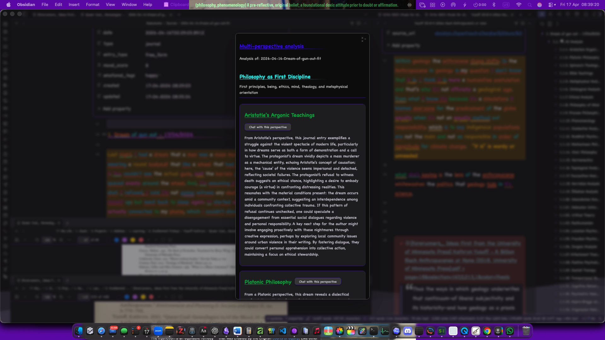

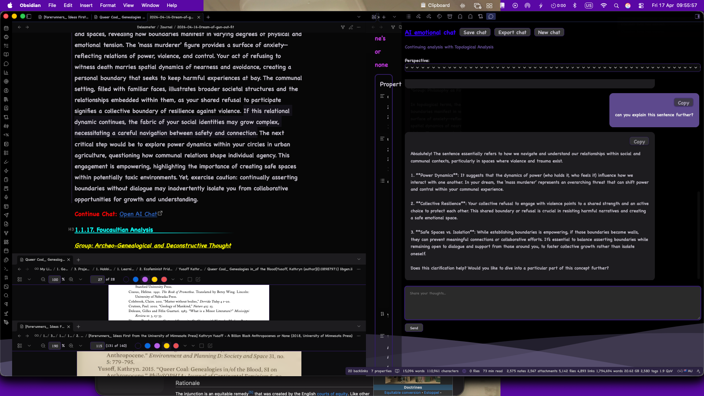

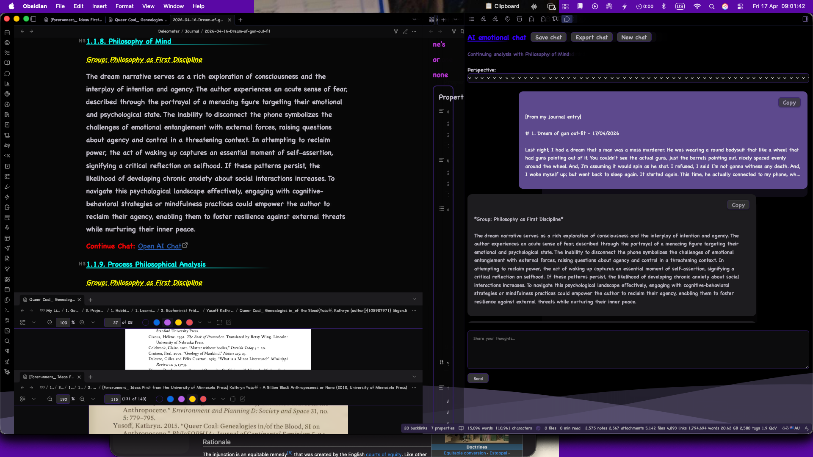

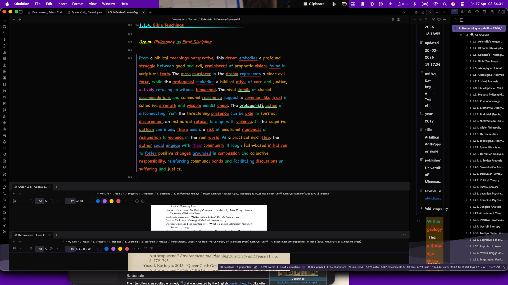

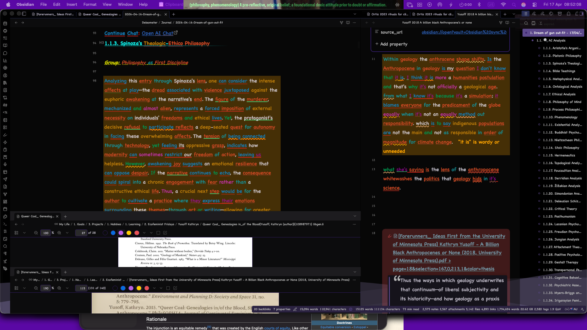

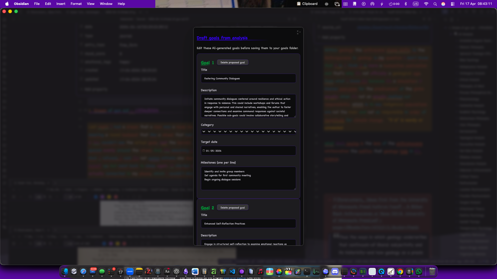

<details>
<summary>Additional beta workflow captures</summary>

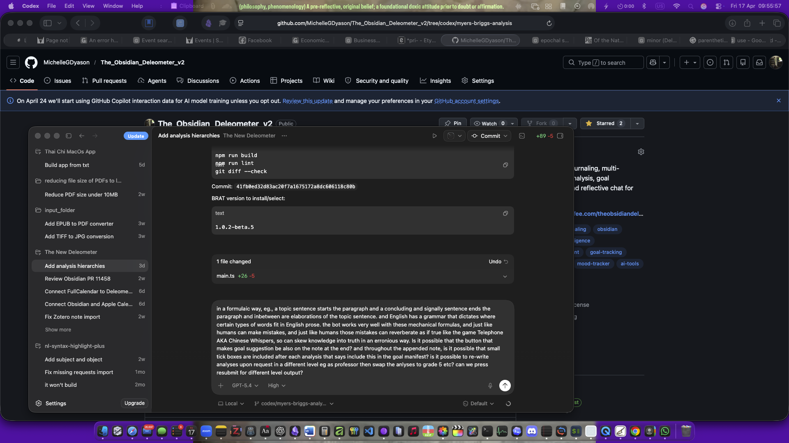


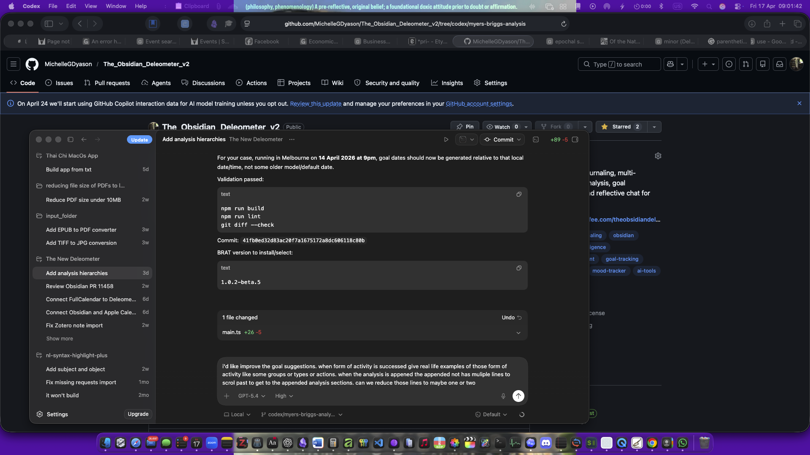


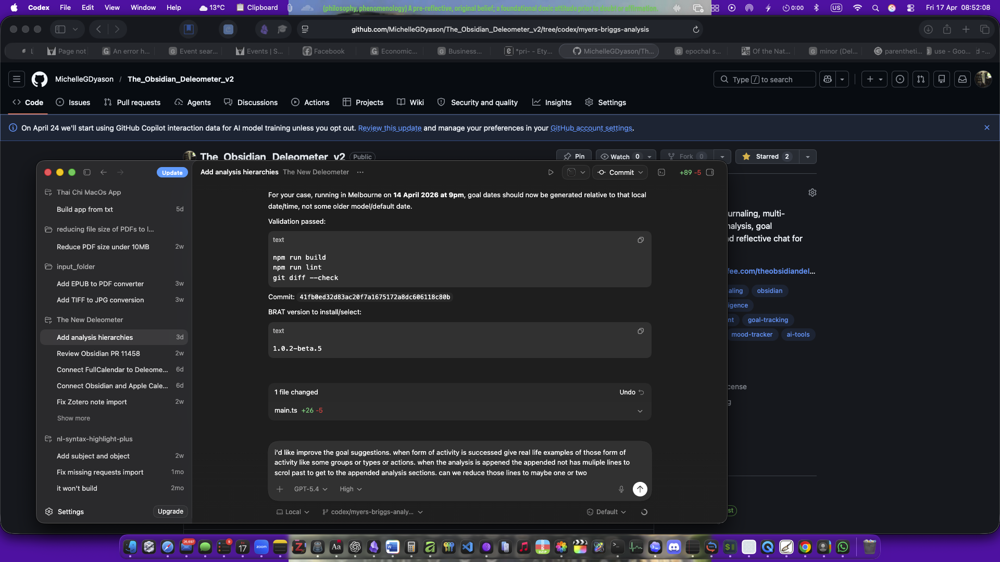

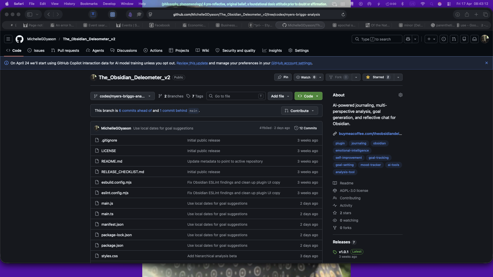

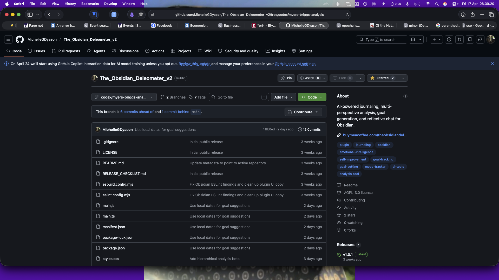

</details>

## Why This Exists

A short personal note about why the plugin was made would be useful for other people. The Deleometer is unusual because it treats a journal entry as something that can be read through many disciplines, not only as mood tracking or productivity data. Explaining the reason for making it can help users understand that the plugin is designed for reflective agency: the author is meant to argue with the AI, learn from it, reject parts of it, and use the conversation to make their own meanings clearer.

## Full Calendar Integration

The plugin can create dated goal and milestone event notes that the [Full Calendar](https://github.com/obsidian-community/obsidian-full-calendar) plugin can display.

It supports:

- goal due dates
- recommended milestone dates
- auto-sync when goals are created
- manual resync via command:
  `Sync goals to Full Calendar`

## Milestone Notes

The plugin can turn the milestones inside each goal into first-class Markdown notes under `Deleometer/Milestones` by default. This makes milestones easier to review, search, link, and reorganise in Obsidian.

Milestone support includes:

- automatic milestone notes when goals are drafted or created
- manual resync via command:
  `Sync milestones to folder`
- a dashboard and settings button for syncing milestones
- consolidation of similar milestone notes via command:
  `Consolidate similar milestones`

Consolidation keeps one merged milestone note and marks the duplicate milestone notes as merged redirects, so the history of where the milestone came from is not simply erased.

## Commands

The plugin includes commands for:

- creating journal entries
- opening the AI chat
- opening the dashboard
- creating goals
- taking the personality assessment
- syncing goals to Full Calendar
- syncing milestones to their folder
- consolidating similar goals
- consolidating similar milestones
- repairing goal note frontmatter
- backfilling analysis chat links for older notes

## Notes for Public Release

Before publishing widely, you will probably want to:

- review [RELEASE_CHECKLIST.md](RELEASE_CHECKLIST.md)
- confirm your GitHub repository details are current in `package.json`
- keep `versions.json` in sync with each release

## Support

- Buy Me a Coffee: [buymeacoffee.com/theobsidiandeleometer](https://buymeacoffee.com/theobsidiandeleometer)
- GitHub Sponsors: [github.com/sponsors/MichelleGDyason](https://github.com/sponsors/MichelleGDyason)

## BRAT Beta Feedback

If you are testing a BRAT prerelease, please open a GitHub issue and include the exact beta version, what you expected, what happened instead, and the steps that led there.

- Open a beta feedback issue:
  [github.com/MichelleGDyason/The_Obsidian_Deleometer_v2/issues/new/choose](https://github.com/MichelleGDyason/The_Obsidian_Deleometer_v2/issues/new/choose)
- Mention whether the behavior happened in:
  - a linked source note
  - a newly exported note
  - goal drafting
  - milestone syncing or consolidation
  - calendar syncing
  - AI chat

Even a short note saying "BRAT beta X works for me on platform Y" is useful, because it helps show whether anyone besides the maintainer is actively testing.

You may also want to add:

- GitHub Issues link
- feature request link
- contact email or site

## License

This project is licensed under the GNU Affero General Public License v3.0. See [LICENSE](LICENSE).

## Analysis Catalogue

The Deleometer currently includes 261 individual analysis frames. Generated analyses are ordered by strict chronology, beginning with accumulated Australian Indigenous philosophy and then moving through ancient, classical, modern, and contemporary traditions so the analyses can show a progression in thought. The catalogue below is grouped as a settings map: groups and individual analyses can be toggled on or off, and group syntheses are produced after the chronological individual analyses have been explicated.

### Philosophy as First Discipline

- Australian Indigenous Philosophy Accumulated
- Buddhist Psychology
- Confucianism
- Platonic Philosophy
- Aristotle's Argonic Teachings
- Cynics' Philosophy
- Stoic Philosophy
- Bible Teachings
- Metaphysical Analysis
- Ontological Analysis
- Ethical Analysis
- Moral Philosophy
- Philosophy of Mind
- Francis Bacon's Experimental Method
- René Descartes' Cogito and Subject
- Spinoza's Theologic-Ethico Philosophy
- Gottfried Wilhelm Leibniz's Monadology
- John Locke's Personal Identity
- David Hume's Bundle Theory of Self
- Aesthetics
- Moral Naturalism
- Metaethics
- Immanuel Kant's Transcendental Subject
- G.W.F. Hegel's Recognition and Subjectivity
- F. W. J. Schelling's Nature Philosophy
- Ralph Waldo Emerson's Environmental Thought
- Nietzschean Philosophy
- Henri Bergson's Duration and Creativity
- William James' Pragmatism
- Set Theory
- Phenomenology
- J. L. Austin's Speech Act Philosophy
- Analytic Moral Philosophy
- Martin Heidegger's Dasein Analysis
- Emmanuel Levinas' Ethics of the Other
- Continental Moral Philosophy
- Hermeneutics
- Existential Analysis
- Jean-Paul Sartre's Subjectivity
- Simone de Beauvoir's Situated Subject
- Maurice Merleau-Ponty's Embodied Subject
- Enactivism
- Feminist Philosophy
- Continental Feminist Philosophy
- Feminist Ethics
- Process Philosophical Analysis
- Vitalism
- Organicism
- P. F. Strawson's Personhood
- Harry Frankfurt's Volitional Self
- Sydney Shoemaker's Self-Knowledge
- Bernard Williams' Personal Identity
- Paul Ricoeur's Narrative Identity
- Derek Parfit's Reductionist Identity
- Jürgen Habermas' Communicative Subject
- Discourse Ethics
- Hannah Arendt's Action and Plurality
- Amartya Sen's Capability Approach
- Charles Taylor's Sources of the Self
- Alasdair MacIntyre's Narrative Self
- Edith Cowan's Civic Reform
- Diane "Ding" Dyason's Practical Ethics
- Jean-Luc Nancy's Being-With
- Judith Butler's Performativity and Subjectivation
- Catriona Mackenzie's Relational Autonomy
- Christine Korsgaard's Self-Constitution
- Marya Schechtman's Narrative Self
- Linda Martín Alcoff's Visible Identities
- Kwame Anthony Appiah's Identity Ethics
- Adriana Cavarero's Relational Uniqueness
- Dan Zahavi's Minimal Self
- Shaun Gallagher's Embodied Self
- Shaun Gallagher's Pattern Theory of Self
- Rosi Braidotti's Nomadic Subjectivity
- Continental Political Aesthetics
- Topological Analysis

### Religious, Mythic, and Pagan Interpretations

- Ancient Religious Interpretation
- Ancient Egyptian Interpretation
- First Testament / Hebrew Interpretation
- Greek Gods Interpretation
- Roman Gods Interpretation
- Druidic Interpretation
- Celtic Religion Interpretation
- Second Testament / Christian Interpretation
- Muslim Interpretation
- Pagan Interpretation
- Herbalism
- Witchcraft

### Social, Spatial, and Research Methods

- Cartographic Analysis
- Geography
- Anthropology
- Archaeology
- Sociology
- Public Policy Analytics
- Social Research Methods
- Pierre Bourdieu's Field, Habitus, and Capital

### Narrative, Media, and Frame Studies

- Linguistic Analysis
- Semiotic Analysis
- Structuralism
- Textual Analysis
- Narrative Psychology
- Creative Non-Fiction
- Music Songwriting Analysis
- Idiotextual Analysis
- Intertextuality
- Frame Analysis
- Erving Goffman's Frame Analysis
- Media Studies
- Jean Baudrillard's Simulacra and Hyperreality
- Poetics
- Art Theory
- Susan Sontag on Interpretation
- Tessa Laird's Cinemal

### Psychology, Psychiatry, Psychoanalysis, and Clinical Approaches

- Freudian Psychoanalysis
- Jungian Analysis
- Lacanian Psychoanalysis
- Julia Kristeva's Abjection and Semiotic
- Psychiatric Assessment
- Psychology
- Anti-Psychiatry
- General Practice Medical Diagnosis
- Attachment Theory
- Gestalt Therapy
- Transpersonal Psychology
- Maslow's Hierarchy of Needs
- Myers-Briggs analysis
- Cognitive Behavioral
- Positive Psychology
- Emotional Intelligence

### Family, Care, and Guidance Theories

- Montessori Method
- Steiner Education
- Jean Piaget's Developmental Theory
- Lev Vygotsky's Sociocultural Theory
- Freirean Pedagogy
- Teaching in Primary School
- Teaching in Secondary School
- Teaching in Tertiary Education
- Trades Pedagogy
- Asian / Japanese Parental Guidance Practices
- African / Zimbabwean Parental Guidance Practices
- Western Parental Guidance Theories
- Advice from Grandma

### Archeo-Genealogical and Deconstructive Thought

- Marxian Analysis
- Georges Bataillean Analysis
- Critical Theory
- Frankfurt School Critical Theory
- Max Horkheimer's Critical Theory
- Theodor W. Adorno's Negative Dialectics
- Louis Althusser's Ideology and Apparatuses
- Simondonian Analysis
- Foucaultian Analysis
- Foucauldian Discourse Analysis
- Derridian Analysis
- Deleuzian Schizoanalysis
- Žižekian Analysis
- Gayatri Chakravorty Spivak's Subaltern Analysis
- Posthumanism

### Gender, Sexuality, and Queer Studies

- Feminist Psychology
- Irigarayian Feminine
- Women's Studies
- Feminist Epistemology
- Feminist Methodologies
- Standpoint Theory
- Radical Feminism
- Ecofeminism
- Lesbian & Gay Studies
- Sexualities Studies
- Gender Studies
- bell hooks' Love and Pedagogy
- Elizabeth Grosz's Corporeal Feminism
- Donna Haraway's Situated Knowledges
- Queer Theory
- Trans Studies

### Race, Coloniality, and Embodiment Studies

- Anti-Colonial Studies
- Critical Race Studies
- Frantz Fanonian Analysis
- Postcolonial Studies
- Decolonial Studies
- Pluriversal Politics
- Edouard Glissant's Poetics of Relation
- Moten and Harney Undercommons
- Crip Studies
- Fat Studies
- Mad Studies

### Systems, Ecology, and Food Futures

- Ecology
- Traditional Ecological Knowledges
- Quantum Theory Analysis
- Gregory Bateson's Ecology of Mind
- James Lovelock's Gaia Theory
- Science and Technology Studies
- Latourian Analysis
- Karen Barad's Agential Realism
- Isabelle Stengers' Cosmopolitics
- New Materialisms
- Naturalism
- Philosophy of Science
- Philosophy of Physics
- Paul Feyerabend's Epistemological Anarchism
- French Philosophy of Science and Relation
- Michel Serres' Relations and Parasites
- Resilience
- Social-Ecological Systems Theory
- Critical Food Systems Analysis
- Food Sovereignty
- Feminist Food Studies
- Biomimicry
- Ecopoiesis
- Rewilding
- Regenerative Design
- Permaculture
- Theory of Landscape Design
- Reciprocity, Mutual Aid, and Sharing Economies
- Jesper Hoffmeyer's Biosemiotics

### Strategy, Method, and Organisation

- Mechanical Engineering Analysis
- Electronics
- Computer Science
- Data Science
- Metascience
- Interdisciplinary Studies
- Australian Legal Discourse
- Architectural Theories
- SWOT Analysis
- Grounded Theory
- Autoethnography
- Conflict Management
- Group Work Theories
- Feasibility Analysis
- Risk Analysis
- Transitional Theory
- Socio-Technical Transitions and the Multi-Level Perspective
- Organisational Theories
- Organisational Transformation
- Theories Growing a Social Movement
- André Baier's TINS_D Analysis
- Tacktical Methodological Analysis
- Study Frameworks
- Imagining Transformative Futures
